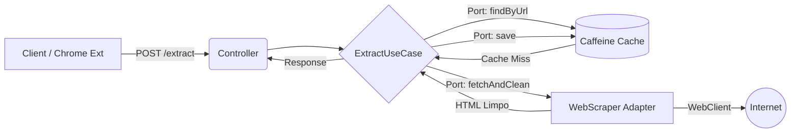

# 📖 CleanRead API

[](https://www.java.com/)
[](https://spring.io/projects/spring-boot)
[](https://docs.spring.io/spring-framework/reference/web/webflux.html)
[](https://www.docker.com/)
[](https://render.com/)

> **Uma API reativa projetada para extrair e purificar conteúdo da web.** Construída com princípios de Arquitetura Hexagonal (Ports & Adapters), focada em alta performance, resiliência e visão de produto.

🔗 **Live Demo:** [https://cleanread-dti0.onrender.com](https://cleanread-dti0.onrender.com) *(Obs: Como está no plano gratuito, a primeira requisição pode levar ~40s para acordar o servidor. As seguintes respondem em milissegundos).*

---

## 🎯 O Problema vs. A Solução

**O Problema:** A web moderna é poluída. Portais de notícias carregam dezenas de megabytes de scripts, banners e pop-ups que degradam a experiência de leitura e consomem banda desnecessária.

**A Solução:** O **CleanRead** atua como um motor de purificação. Ele recebe a URL de um artigo, faz o download via chamadas não-bloqueantes, processa a árvore DOM (removendo ruídos), calcula métricas de poluição e devolve um JSON enxuto contendo apenas o que importa: a informação.

---

## 🏗️ Arquitetura e Stack Tecnológica

O projeto foi intencionalmente desenhado utilizando **Clean Architecture** para garantir que a regra de negócio (Purificação de Conteúdo) esteja completamente isolada de frameworks ou detalhes de infraestrutura.

- **Linguagem:** Java 17/21
- **Framework:** Spring Boot com Spring WebFlux (Programação Reativa)
- **Scraping Engine:** JSoup (DOM Manipulation)
- **Cache:** Caffeine (In-Memory)
- **Resiliência:** Tratamento global de exceções e limitação customizada de buffer de memória no WebClient para suportar payloads gigantes.

### Fluxo da Aplicação (Ports & Adapters)



## 🚀 O Ecossistema (Backend + Frontend)
Este projeto não é apenas uma API solta, mas um produto funcional que consiste em duas partes:

- **Core Engine (Este repositório):** A API reativa construída em Java.
- **Extensão do Chrome (Frontend):** Uma extensão leve (Manifest V3) que se conecta a esta API, permitindo que o usuário limpe a página em que está navegando com um clique, injetando uma interface de leitura elegante e com suporte automático a Dark Mode.

## 🔌 Documentação da API
### POST /api/v1/articles/extract
Extrai o conteúdo principal de uma página web.

**Request Body:**

```json
{
    "url": "https://g1.globo.com/exemplo-de-noticia"
}
```

**Response (200 OK):**

```json
{
    "url": "https://g1.globo.com/exemplo-de-noticia",
    "title": "Título Original da Notícia",
    "author": "Nome do Autor",
    "content": "<p>Conteúdo limpo formatado em HTML nativo...</p>",
    "metrics": {
        "estimatedReadingTimeMinutes": 5,
        "removedElementsCount": 142,
        "pollutionScore": 8.5
    }
}
```

## 🛠️ Como Executar Localmente
### Opção 1: Usando Docker (Recomendado)
O projeto contém um Dockerfile otimizado com multi-stage build para garantir uma imagem leve.

```bash
# Construir a imagem
docker build -t cleanread-api .

# Rodar o contêiner na porta 8080
docker run -p 8080:8080 cleanread-api
```

### Opção 2: Usando Maven Wrapper (Local)
Certifique-se de ter o Java instalado em sua máquina.

**Windows**
```bash
.\mvnw.cmd clean package
.\mvnw.cmd spring-boot:run
```

**Linux / Mac**
```bash
./mvnw clean package
./mvnw spring-boot:run
```

## 🧪 Testes
A arquitetura orientada a interfaces (Ports) torna o sistema altamente testável. Para rodar a suíte de testes unitários e de integração:

```bash
# Windows
.\mvnw.cmd test

# Linux / Mac
./mvnw test
```

## 📈 Roadmap & Evolução do Produto
Este MVP foi construído com a extensibilidade em mente. Os próximos passos técnicos previstos incluem:

- [ ] **Banco de Dados Reativo (R2DBC):** Substituir o cache em memória por PostgreSQL para manter o histórico global de artigos limpos.
- [ ] **Integração com IA (NLP):** Utilizar LLMs para gerar resumos automáticos (bullet-points) no topo do artigo extraído.
- [ ] **Rate Limiting & Segurança:** Implementar um API Gateway com Redis para controle de tráfego.

---
*Desenvolvido com foco em Engenharia de Software e Qualidade de Produto.*

