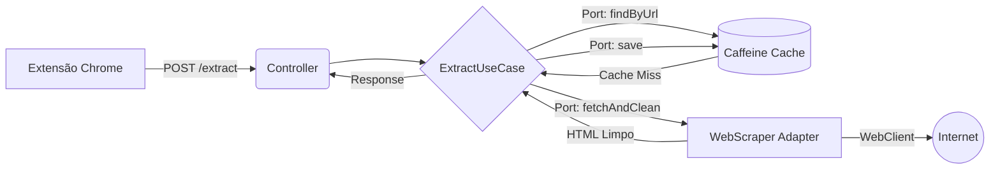

# 📖 CleanRead

[](https://www.java.com/)
[](https://spring.io/projects/spring-boot)
[](https://docs.spring.io/spring-framework/reference/web/webflux.html)
[](https://developer.chrome.com/docs/extensions/)
[](https://render.com/)

> **Uma solução full-stack projetada para extrair e purificar conteúdo da web.** Combina uma Extensão de Navegador nativa com uma API reativa focada em alta performance, resiliência e visão de produto.

🔗 **Status do Deploy:** [API no ar via Render](https://cleanread-dti0.onrender.com) *(Obs: Como está no plano gratuito, a primeira requisição do dia pode levar ~40s para acordar o servidor. As seguintes respondem em milissegundos).*

---

## 🎯 O Problema vs. A Solução

**O Problema:** A web moderna é poluída. Portais de notícias carregam dezenas de megabytes de scripts, banners e pop-ups que degradam a experiência de leitura e consomem banda desnecessária.

**A Solução:** O **CleanRead** atua como um motor de purificação. O usuário clica na extensão do navegador e, em milissegundos, a API faz o download reativo da página, processa a árvore DOM (removendo ruídos), calcula métricas de poluição e a extensão injeta uma interface de leitura limpa e focada (com suporte a Dark Mode).

---

## 🏗️ Arquitetura do Repositório (Monorepo)

Este projeto foi estruturado como um monorepo, separando claramente o motor de processamento (Backend) da interface de usuário (Extensão).

```text
📁 cleanread
├── 📁 backend-api/       # API em Java (Spring WebFlux + Hexagonal Architecture)
└── 📁 chrome-extension/     # Frontend (Extensão do Chrome Manifest V3)
```
### ⚙️ O Backend (API Engine)
A API foi intencionalmente desenhada utilizando Clean Architecture (Ports & Adapters) para garantir que a regra de negócio esteja completamente isolada de frameworks ou detalhes de infraestrutura.

*   **Linguagem:** Java 21
*   **Framework:** Spring Boot com Spring WebFlux (I/O Não-bloqueante)
*   **Scraping Engine:** JSoup (Manipulação de DOM em memória)
*   **Cache:** Caffeine (Armazenamento rápido In-Memory)
*   **Resiliência:** Tratamento global de exceções e limitação customizada de buffer no Netty (WebClient) para suportar payloads gigantes sem causar OutOfMemory.

#### Fluxo de Processamento


### 🎨 O Frontend (Extensão do Chrome)
A interface do usuário é uma extensão leve e rápida, construída com foco em UX.

*   **Manifest V3:** Padrão moderno e seguro do Google Chrome.
*   **Injeção Dinâmica:** Usa `chrome.scripting` para sobrepor o site poluído com a interface de leitura.
*   **Tipografia e UX:** Design responsivo, tipografia fluida para leitura prolongada (Medium-style) e suporte automático a Dark Mode (`prefers-color-scheme`).

---

## 🔌 Documentação da API
`POST /api/v1/articles/extract`

Extrai o conteúdo principal de uma página web.

**Request Body:**

```json
{
    "url": "https://g1.globo.com/exemplo-de-noticia"
}
```
**Response (200 OK):**

```json
{
    "url": "https://g1.globo.com/exemplo-de-noticia",
    "title": "Título Original da Notícia",
    "author": "Nome do Autor",
    "content": "<p>Conteúdo limpo formatado em HTML nativo...</p>",
    "metrics": {
        "estimatedReadingTimeMinutes": 5,
        "removedElementsCount": 142,
        "pollutionScore": 8.5
    }
}
```

---

## 🛠️ Como Executar Localmente
### 1. Rodando a API (Backend)
Você pode rodar usando Docker ou Maven localmente.

**Via Docker (Recomendado):**

```bash
cd backend-api
docker build -t cleanread-api .
docker run -p 8080:8080 cleanread-api
```

**Via Maven Wrapper:**

```bash
cd backend-api
# Windows
.\\mvnw.cmd clean package
.\\mvnw.cmd spring-boot:run

# Linux / Mac
./mvnw clean package
./mvnw spring-boot:run
```

### 2. Instalando a Extensão (Frontend)
1.  Abra o Google Chrome e acesse `chrome://extensions/`.
2.  Ative o "Modo do desenvolvedor" no canto superior direito.
3.  Clique em "Carregar sem compactação" (Load unpacked).
4.  Selecione a pasta `chrome-extension` deste repositório.
5.  Pronto! Fixe o ícone do CleanRead na barra do seu navegador.

---

## 📈 Roadmap & Próximos Passos
- [ ] **Persistência (R2DBC):** Substituir o cache em memória por PostgreSQL para manter o histórico global de artigos processados e gerar estatísticas.
- [ ] **Resumo com IA (NLP):** Integrar com modelos de linguagem (LLMs) para gerar um bullet-point resumido no topo de cada artigo longo.
- [ ] **Rate Limiting:** Implementar controle de tráfego usando Redis e API Gateway para proteção contra abusos.

---

*Desenvolvido com foco em Engenharia de Software e Qualidade de Produto.*
